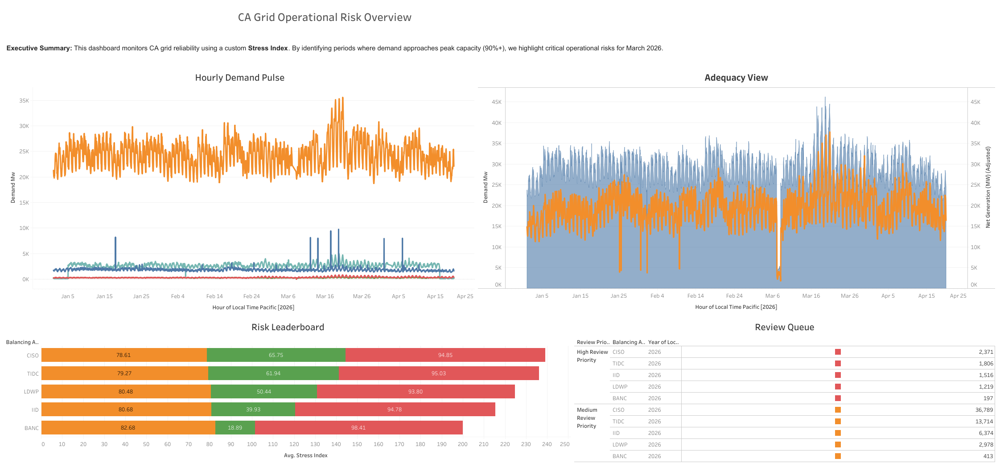

# California Grid Reliability Analysis: Dashboarding Operational Risk in Electricity Demand and Supply

**Author:** Sileshi Hirpa
**Date:** April–May 2026
**Tools:** Python · pandas · Plotly · Jupyter Notebook · Tableau Public · Power BI (planned)
**Data:** EIA Form EIA-930, Balancing Authority Hourly Operations (public domain)

---

## 1. Executive Summary

This project is a data analytics, business intelligence, and dashboard engineering portfolio project built around publicly available California electricity grid data. It demonstrates a complete analytical workflow — from raw data ingestion and cleaning through feature engineering, dashboard-ready data modeling, and interactive dashboard delivery.

The project transforms hourly EIA-930 balancing authority data into a structured set of visual products that support grid reliability monitoring and operational risk review. The primary output is an interactive Tableau Public dashboard. A Power BI cross-platform version is planned as a beginner-level demonstration of transferable dashboard thinking.

Key skills demonstrated:

- End-to-end data preparation pipeline in Python
- Scope validation and analytical correction workflow
- Time-series visualization with multiple balancing authorities
- Custom feature engineering (Stress Index, review priority tiers)
- Dashboard data modeling with separate detail and summary layers
- Interactive Tableau dashboard design following visualization engineering principles
- Repository hygiene and reproducibility documentation

This project sits alongside a fraud detection analysis as one of two flagship portfolio projects showcasing data analytics, business intelligence, and data visualization engineering skills.

---

## 2. Problem Statement

California's electricity grid is managed across multiple balancing authorities responsible for matching supply and demand in real time. Understanding when and where demand approaches observed peak levels is a core operational review task.

**Business question:** How can hourly California electricity demand data be prepared, validated, and visualized so that a reviewer can quickly identify periods that may deserve additional operational attention?

This project answers that question through a structured Python pipeline, a custom Stress Index, and an interactive Tableau dashboard with multiple complementary views.

---

## 3. Why Grid Reliability Matters

Grid reliability failures carry significant consequences: service disruptions affect hospitals, emergency services, households, and businesses. Monitoring demand relative to observed peak capacity helps analysts identify periods of elevated stress before they become reliability events.

This project does not model reliability events directly — it uses public EIA demand data and a custom review indicator to practice the analytical habits that support reliability monitoring: scope validation, time-aware data preparation, relative stress measurement, and priority-ranked summary tables.

The analytical approach is designed to be transferable to public-sector utility analytics, energy policy research, and operational risk roles in the energy sector.

---

## 4. Data Sources

| Source | Description |
| --- | --- |
| EIA Form EIA-930 | Hourly balancing authority operations data published by the U.S. Energy Information Administration |
| Publisher | U.S. Energy Information Administration (public domain) |
| Time period | January–April 2026 |
| Download page | https://www.eia.gov/electricity/gridmonitor/dashboard/electric_overview/US48/US48 |
| Raw file | `EIA930_BALANCE_2026_Jan_Jun.csv` (~27 MB) |
| Scope after filtering | California balancing authorities only: BANC, CISO, IID, LDWP, TIDC |
| Rows after filtering | 13,020 hourly records |

Raw and processed data files are excluded from this repository due to file size. See `data/README.md` for full download and reproduction instructions.

---

## 5. Project Workflow

```
EIA-930 raw download (~27 MB)
  -> notebooks/california_grid_analysis.ipynb
       Step 1-4:  Load, rename, clean, convert UTC to Pacific Time
       Step 5-9:  Validate California scope, filter to 5 BAs
       Step 10-16: Rebuild visualizations, engineer Stress Index, classify priorities
       Step 17-20: Build review table, export processed outputs
  -> data/processed/cleaned_california_grid_data.csv  (69 columns, 13,020 rows)
  -> Phase 4 data model build
       -> california_grid_dashboard_ready.csv      (9 columns, 13,020 rows)
       -> california_grid_monthly_summary.csv      (11 columns, 20 rows)
       -> california_grid_hourly_risk_summary.csv  (10 columns, 120 rows)
       -> california_grid_kpi_summary.csv          (12 columns, 5 rows)
  -> Tableau Desktop
       Individual worksheets -> assembled dashboard -> published to Tableau Public
  -> Power BI Desktop (planned)
       Import summary tables -> interactive report visuals -> report page
```

---

## 6. Data Preparation

The notebook performs the following preparation steps before any visualization is built:

1. **Load** the raw EIA-930 CSV using `pandas`, with `low_memory=False`
2. **Rename** eight key columns to clean snake_case field names
3. **Remove null records** on three required fields: balancing authority, UTC timestamp, demand MW
4. **Deduplicate** on the combination of balancing authority and UTC timestamp
5. **Convert timestamps** from UTC to Pacific Time using `tz_convert("America/Los_Angeles")`, handling PST/PDT transitions correctly
6. **Convert numeric columns** using `pd.to_numeric(errors="coerce")` to handle mixed-type fields in the source data
7. **Validate scope** — the raw file contains balancing authorities from across the United States; the notebook explicitly investigates a misleading first chart, identifies the multi-region scope issue, and filters to California-only BAs
8. **Export** the cleaned California-only dataset for downstream use

The scope validation step (identifying and correcting a misleading chart caused by non-California data) is documented deliberately. It reflects a core principle: a chart can run without error and still be wrong if the data scope does not match the business question.

---

## 7. Feature Engineering

Two engineered fields are added to the cleaned California-only dataset:

**stress_index**

Calculated as `(demand_mw / peak_demand_mw) × 100`, where `peak_demand_mw` is the maximum observed demand for that balancing authority within the dataset window. The result is a 0–100 scale expressing each hour's demand as a percentage of observed peak demand.

**review_priority**

A categorical label derived from `stress_index`:

| Label | Stress Index Range | Hours in Dataset |
| --- | --- | --- |
| High Review Priority | >= 90 | 75 |
| Medium Review Priority | >= 75 and < 90 | 762 |
| Low Review Priority | < 75 | 12,183 |

These thresholds are documented in the notebook and in `docs/dashboard_data_dictionary.md`. Promoting them to named constants at the top of the notebook is a planned improvement.

---

## 8. Grid Stress Index

The Stress Index is the central analytical metric of this project.

**Formula:**

```
Stress Index = (Current Demand / Peak Demand for that Balancing Authority) x 100
```

**Why a relative index rather than raw demand values?**

California's five balancing authorities differ greatly in scale. CISO serves the majority of the state and operates at tens of thousands of megawatts. Smaller authorities such as IID and TIDC operate at hundreds of megawatts. A raw demand threshold would systematically miss stress events at smaller authorities. The Stress Index normalizes each authority against its own observed peak, enabling fair comparison across scales.

**Important limitation:**

The peak demand denominator is derived from the January–April 2026 dataset window only. It is not derived from a historical multi-year record. Stress Index values should be interpreted as relative indicators within this dataset, not as comparisons against all-time historical peaks.

This limitation is documented in the notebook, the data dictionary, and the dashboard build plan.

---

## 9. Dashboard Data Model

The pipeline produces four dashboard-ready files, each serving a distinct role in the visualization layer:

| File | Rows | Size | Role |
| --- | --- | --- | --- |
| `california_grid_dashboard_ready.csv` | 13,020 | 1.1 MB | Hourly detail — primary Tableau data source |
| `california_grid_monthly_summary.csv` | 20 | 1.3 KB | Month-level trend charts |
| `california_grid_hourly_risk_summary.csv` | 120 | 5.5 KB | Hour-of-day stress profile and heatmap |
| `california_grid_kpi_summary.csv` | 5 | 724 B | KPI cards — one row per balancing authority |

Separating detail and summary layers keeps dashboard queries fast, simplifies calculated fields in Tableau and Power BI, and prepares the architecture for future expansion to multi-year datasets.

All four files are generated by the Phase 4 data model build step and are excluded from version control. The data model is documented in full in `docs/dashboard_data_model.md` and `docs/dashboard_data_dictionary.md`.

---

## 10. Tableau Dashboard

**Tableau is the primary dashboard layer for this project.**

The dashboard is built as a real interactive Tableau workbook: individual worksheets are created for each analytical view, then assembled into a dashboard layout with shared filters and cross-sheet interactions. The workflow is:

```
Data source (california_grid_dashboard_ready.csv)
  -> Individual Tableau worksheets (one per view)
    -> Dashboard assembled from worksheets
      -> Published to Tableau Public
```

The dashboard includes four main views:

- **Hourly Demand Pulse** — time-series line chart tracking hourly demand for each California balancing authority over the dataset window
- **Adequacy View** — comparison of demand against net generation, with interchange context available in tooltips
- **Risk Leaderboard** — horizontal bar chart ranking balancing authorities by average Stress Index
- **Review Queue** — ranked table of hours organized by review priority, filterable by authority and priority tier

**Interactive Tableau Public dashboard:**

[Explore the California Grid Reliability Monitor on Tableau Public](https://public.tableau.com/app/profile/sileshi.hirpa1285/viz/CAGridOperationalRiskReliabilityDashboard/riskOverview#1)

**Dashboard preview** (static screenshot for GitHub and portfolio use):



The screenshot above is a portfolio preview asset for GitHub, website, and LinkedIn embedding. The interactive version on Tableau Public is the primary deliverable.

The full Tableau build specification is documented in `docs/tableau_dashboard_build_plan.md`.

---

## 11. Power BI Version

A Power BI cross-platform version is planned as a simplified beginner-level demonstration of transferable dashboard thinking. It has not yet been built. The intended workflow will mirror the Tableau build:

```
Data source (CSV files)
  -> Power BI Desktop (import + build interactive report visuals)
    -> Report page / dashboard (interactive filters, slicers)
      -> Optional: Publish to Power BI Service for a shareable web link
```

When built, the Power BI version will use the same four dashboard-ready CSV files as data sources. It will demonstrate standard Power BI visuals (card, line chart, bar chart, table), basic DAX measures for KPI aggregation, and slicer-driven interactivity.

This version will not claim advanced Power BI expertise. It is positioned as a demonstration that the same data model and analytical questions can be addressed across different BI platforms using beginner-to-intermediate tool skills.

The `.pbix` file will be kept local and excluded from this repository via `.gitignore`. When built, a Power BI Service link and a portfolio screenshot will be added to the assets and README.

The full Power BI build plan is documented in `docs/power_bi_beginner_build_plan.md`.

---

## 12. Key Findings

- **CISO dominates by scale.** The California ISO operates at demand levels far exceeding the other four balancing authorities. In a combined view, CISO's scale compresses all other series. A panel view is required to meaningfully review smaller authorities.
- **75 High Review Priority hours** were identified across all five California balancing authorities during the January–April 2026 period, representing approximately 0.58% of total hourly observations.
- **762 Medium Review Priority hours** were identified (approximately 5.85% of observations), forming a broader band of elevated demand worth tracking in trend context.
- **Peak demand reached 35,596 MW** (CISO), observed during a single hour in the dataset window.
- **Average Stress Index across all authorities was 48.6%**, indicating that most operational hours fell well below observed peak levels during this period.
- **Demand follows clear daily cycles.** The hour-of-day profile shows consistent patterns of lower overnight demand and higher afternoon demand across all five authorities.
- **Smaller authorities have distinct stress profiles.** IID and TIDC show different peak-hour patterns from CISO and BANC, which a combined view would obscure. Per-authority analysis is essential for fair comparison.

---

## 13. Data Visualization Engineering Considerations

### Performance and scalability

The dashboard data model separates hourly detail (13,020 rows) from pre-aggregated summary tables (5–120 rows). Summary tables support overview and trend views without requiring the dashboard tool to aggregate the full detail file at render time. This architecture scales to multi-year datasets without requiring changes to the dashboard layer — only the upstream pipeline and summary tables need to be updated.

### Use of processed and summary datasets

No raw data enters the dashboard layer. The 27 MB raw EIA file and the 3.6 MB wide processed file (69 columns) are excluded from the repository and from Tableau and Power BI connections. All dashboard connections use the slim 9-column detail file or one of the three pre-aggregated summary files.

### Dashboard interactivity

The Tableau dashboard is built as an interactive workbook with cross-sheet filters responding to balancing authority, review priority, and date range selections. The Stress Index and review priority fields are designed to support drill-down from the Risk Leaderboard into the Review Queue. The planned Power BI version will mirror this interaction model using the same field structure and slicer-driven navigation.

### Accessibility and readable design

The dashboard color palette is drawn from the Okabe-Ito colorblind-safe set, avoiding red-green combinations that cause confusion for viewers with common color vision deficiencies:

| Priority level | Color | Hex |
| --- | --- | --- |
| High Review Priority | Dark orange-red | `#D55E00` |
| Medium Review Priority | Amber | `#E69F00` |
| Low Review Priority | Steel blue | `#0072B2` |

All chart titles use plain-language descriptions. Tooltips expose additional context fields without cluttering the main chart view. Full WCAG contrast checks are listed as a planned improvement.

### Future custom visualization extensions

The following extensions are documented as possible future enhancements and are not currently implemented:

- **Geographic choropleth** — mapping Stress Index by balancing authority service territory using Mapbox or an equivalent tool
- **Custom web dashboard** — a prototype built with React and D3.js demonstrating custom interactive time-series visualization beyond BI tools
- **Real-time or near-real-time data pipeline** — extending the EIA data connection to refresh automatically as new hourly data becomes available
- **Forecast error overlay** — comparing actual demand against the EIA forecast field to surface systematic over- or under-prediction patterns

None of these extensions are claimed as current capabilities.

---

## 14. Repository Structure

```
california-grid-reliability-dashboard/
├── assets/
│   ├── Dashboard_riskOverview.png     # Dashboard preview screenshot
│   └── PGE_One_Slide_Summary.pdf      # One-slide project summary
├── data/
│   ├── raw/
│   │   └── .gitkeep                   # Directory placeholder (raw CSV excluded)
│   ├── processed/
│   │   └── .gitkeep                   # Directory placeholder (processed CSVs excluded)
│   └── README.md                      # Data sources and reproduction instructions
├── docs/
│   ├── dashboard_data_dictionary.md   # Field definitions for all dashboard files
│   ├── dashboard_data_model.md        # Data model architecture and Git commit guide
│   ├── data_visualization_engineering_readiness_review.md
│   ├── power_bi_beginner_build_plan.md
│   ├── tableau_dashboard_build_plan.md
│   └── visualization_engineering_roadmap.md
├── notebooks/
│   └── california_grid_analysis.ipynb # Full analytical pipeline (outputs stripped)
├── outputs/
│   └── .gitkeep                       # Directory placeholder (output CSVs excluded)
├── .gitignore
├── README.md
└── requirements.txt
```

Data files in `data/raw/`, `data/processed/`, and `outputs/` are excluded from version control. See `data/README.md` for download and reproduction instructions.

---

## 15. How to Run

### Requirements

```
pandas>=1.2.0
numpy>=1.20.0
plotly>=5.0.0
notebook>=6.0.0
```

Install dependencies:

```bash
pip install -r requirements.txt
```

### Step 1 — Download the raw data

Follow the instructions in `data/README.md` to download `EIA930_BALANCE_2026_Jan_Jun.csv` from the EIA Grid Monitor and place it at `data/raw/EIA930_BALANCE_2026_Jan_Jun.csv`.

### Step 2 — Run the analysis notebook

```bash
jupyter notebook notebooks/california_grid_analysis.ipynb
```

Run all cells from top to bottom. The notebook will:

- Load and clean the raw data
- Filter to California balancing authorities
- Engineer the Stress Index and review priority fields
- Export `data/processed/cleaned_california_grid_data.csv`
- Export `outputs/top_review_hours_california.csv`

### Step 3 — Build the dashboard-ready files

Run the Phase 4 data model build step to generate the four dashboard-ready CSV files in `data/processed/`.

### Step 4 — Open the Tableau dashboard

The interactive dashboard is published on Tableau Public and does not require a local Tableau installation to view:

[Explore the California Grid Reliability Monitor](https://public.tableau.com/app/profile/sileshi.hirpa1285/viz/CAGridOperationalRiskReliabilityDashboard/riskOverview#1)

To build or modify the dashboard locally, open Tableau Desktop and connect to `data/processed/california_grid_dashboard_ready.csv`.

---

## 16. Dashboard Screenshots and Links

| Dashboard | Link | Preview |
| --- | --- | --- |
| Tableau Public (interactive) | [Open dashboard](https://public.tableau.com/app/profile/sileshi.hirpa1285/viz/CAGridOperationalRiskReliabilityDashboard/riskOverview#1) | See `assets/Dashboard_riskOverview.png` |
| Power BI (planned) | Link will be added when built | Preview screenshot will be added to `assets/` |


---

## 17. Limitations

- **Dataset window:** The analysis covers January–April 2026 only. The Stress Index denominator is derived from observed peak demand within this window, not from a full historical record. Values reflect relative demand behavior during this period and should not be interpreted as comparisons against all-time peaks.
- **Public data only:** This project uses public EIA-930 data. It does not represent any utility's internal operational systems, enterprise risk models, internal safety frameworks, or proprietary data pipelines.
- **Stress Index is a learning metric:** The Stress Index is a custom review-prioritization tool built for portfolio practice. It is not a formal operational risk score and does not replicate any utility's internal methodology.
- **No real-time connection:** The dataset is static. The pipeline does not refresh automatically as new EIA data becomes available.
- **No consequence or impact modeling:** This project identifies periods of elevated demand relative to observed peak. It does not model the probability or consequence of reliability events.
- **Power BI version is not yet built:** The Power BI cross-platform version is planned and documented in `docs/power_bi_beginner_build_plan.md`. It will be added to the portfolio when complete.

---

## 18. Future Improvements

- **Forecast error analysis** — compare `demand_mw` against `demand_forecast_mw` to surface systematic prediction gaps by authority and hour of day
- **Extended date range** — expand the pipeline to cover a full calendar year or multiple years for seasonality analysis
- **Power BI interactive report** — build the planned beginner cross-platform version using the existing data model
- **WCAG accessibility audit** — apply contrast checks to all dashboard color choices and update the palette where needed
- **Geographic choropleth** — map Stress Index by balancing authority service territory
- **Anomaly detection** — apply a statistical threshold (e.g. z-score or rolling percentile) as an alternative or complement to the fixed Stress Index tiers
- **Refined Stress Index methodology** — replace the dataset-window peak with a rolling historical peak or a seasonally adjusted baseline
- **Named constants for review thresholds** — promote the High and Medium priority cutoff values to named constants at the top of the notebook for clarity and maintainability
- **Custom web dashboard prototype** — explore a React and D3.js implementation for a future portfolio extension demonstrating custom visualization engineering beyond BI tools

---

## 19. Author

**Sileshi Hirpa**
Data Science and Analytics Student
Arizona State University

Portfolio: [GitHub](https://github.com/sileshith) · [Tableau Public](https://public.tableau.com/app/profile/sileshi.hirpa1285)

---

*Last updated: 2026-05-03*
